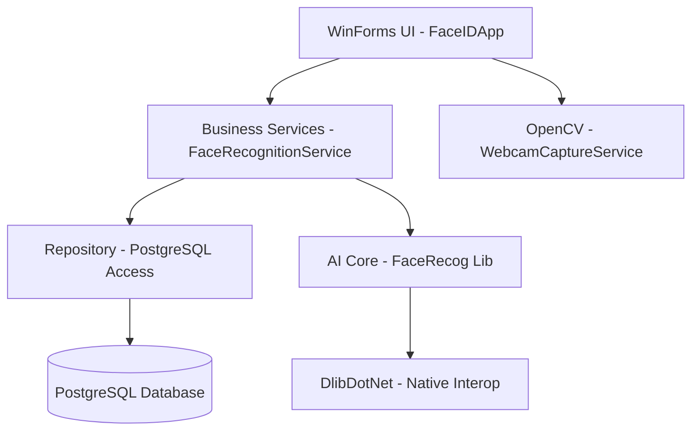
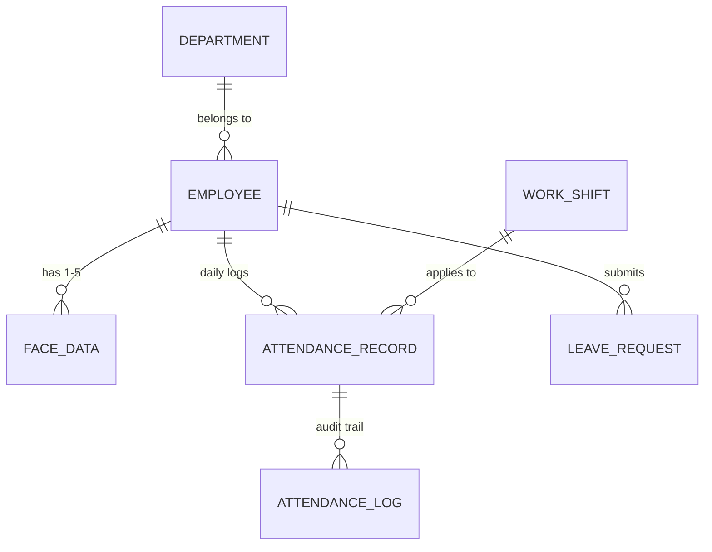

# Project Skills: FaceID Attendance System (LLM & Agent Handbook)

This document is optimized for **Claude**, **Gemini**, and human developers to understand, maintain, and expand the **FaceRecog** ecosystem with 100% precision.

---

## 🚀 1. Project Context & Tech Stack
A professional Windows-based Attendance System using deep learning for face recognition and PostgreSQL for robust data management.

- **Frontend**: C# WinForms (.NET 4.6.1), Fluent-inspired custom UI.
- **AI Core**: Dlib (via `DlibDotNet`), ResNet-based face encoding.
- **Vision**: OpenCV (`OpenCvSharp4`) for real-time capture.
- **Data**: PostgreSQL (`Npgsql`) with raw SQL Repository pattern.
- **Architecture**: N-Tier (UI -> Logic/DTO -> Data/P-Invoke).

---

## 🏗 2. System Architecture

---

## 📁 3. Knowledge Map (Directory Roles)

| Path (Absolute) | Role | Primary Responsibility |
| :--- | :--- | :--- |
| `src/FaceRecog/` | **AI Driver** | C# wrapper for Dlib native P/Invoke. |
| `FaceIDApp/Data/` | **Logic Layer** | `FaceRecognitionService.cs` (Matching), `Repository.cs` (DB). |
| `FaceIDApp/UserControls/` | **UI Modules** | Modular tabs like `UCAttendance.cs`, `UCEmployeeManagement.cs`. |
| `FaceIDApp/Database/` | **Storage Schema** | `face_attendance_v3.sql` - Single source of truth for DB. |
| `models/` | **Brain Assets** | Pre-trained `.dat` weights (critical for runtime). |

---

## 💾 4. Database & State Protocols

### ERD (Core Entities)

### 🧬 Data Encoding Protocol
- **Face Vectors**: Stored in `face_data.encoding` as a `TEXT` field.
- **Serialization**: `double[128]` converted to a semicolon-separated string (e.g., `0.12;-0.45;...`).
- **Deserialization**: Handled by `FaceEncodingCodec.cs` in `FaceIDApp/Data/`.

---

## 🤖 5. AI & Computer Vision Deep-Dive

### 🛡️ The Unicode Path "Safe" Hack
> [!IMPORTANT]
> **Native Limitation**: The Dlib DLL cannot read model files from paths containing Unicode/Non-ASCII characters (e.g., "Tiếng Việt").
> **Solution**: `ModelsDirectoryResolver.cs` detects unsafe paths and automatically mirrors model files to `%TEMP%\FaceIDApp_models`. Always use this resolver to obtain model paths.

### 🎯 Recognition Parameters
- **Tolerance**: `0.6` (Euclidean distance). Lower = stricter.
- **Upsampling**: 1 iteration by default. If no face is found, the system retries with up to 2 iterations (increasing detection hit-rate at a performance cost).
- **Landmarks**: 5-point predictor used for high-speed alignment; 68-point supported by switching `.dat` files.

---

## 🎨 6. UI Design System (Visual Tokens)
To maintain the "Fluent Slate" aesthetic, agents MUST use these tokens:

- **Colors**:
    - `SidebarBg`: `#0F172A` (Slate 900)
    - `PrimaryBlue`: `#38BDF8` (Sky 400)
    - `AccentHover`: `#1E293B` (Slate 800)
    - `TextDim`: `#64748B` (Slate 500)
- **Drawing**: Avoid standard `BorderStyle`. Use `GDI+` (`OnPaint`) for linear gradients and rounded cards with `SmoothingMode.AntiAlias`.

---

## 🛠 7. Agent Instruction Manual

### How to Modify Data Logic
1.  **DTO**: Add property to `Dtos.cs` (`FaceIDApp/Data/`).
2.  **Repo**: Update SQL string and reader in `Repository.cs`.
3.  **UI**: Bind the new property in the relevant `.cs` UserControl.

### How to Fix Detection Issues
- If "Face Not Found" consistently: Check `FaceRecognitionService.LocateFaces` for upsampling levels.
- If "Wrong Identity": Check `FaceRecognition.FaceDistance` logic and the `tolerance` threshold in `App.config` or settings.

### Database Migration
Modify the master SQL file `FaceIDApp/Database/face_attendance_v3.sql`. The `DatabaseBootstrapper.cs` will handle logic for re-initializing schema if needed during development.

---

## 🔧 Build Pre-requisites
- **Platform**: Must be **x64** (Dlib native dependency).
- **PostgreSQL**: Version 15+ recommended.
- **Assets**: 2 required `.dat` files must reside in the executable's `models/` folder.
